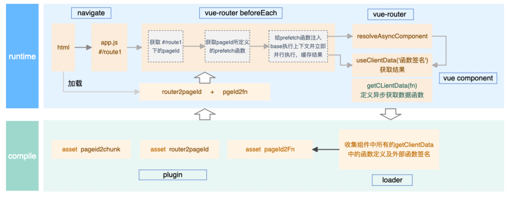
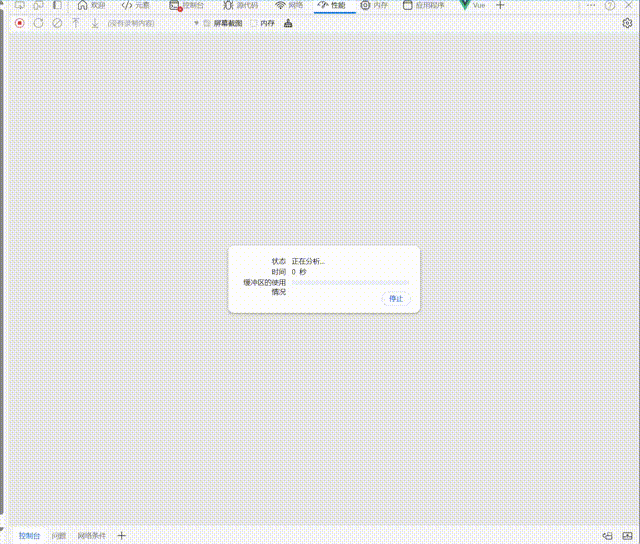
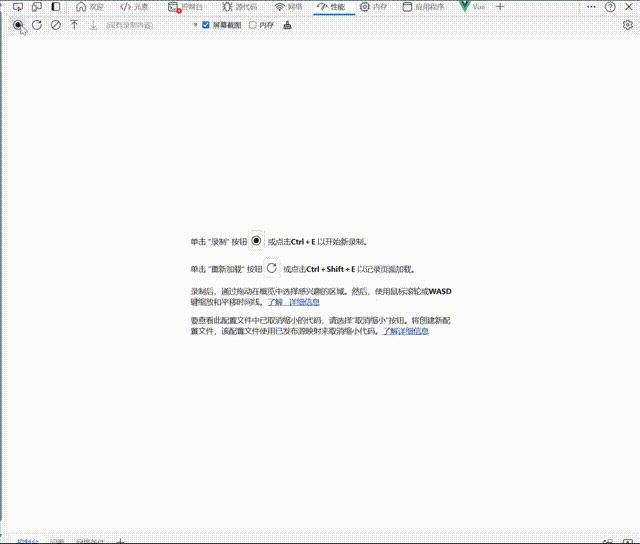
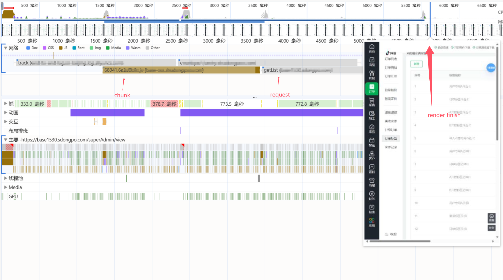
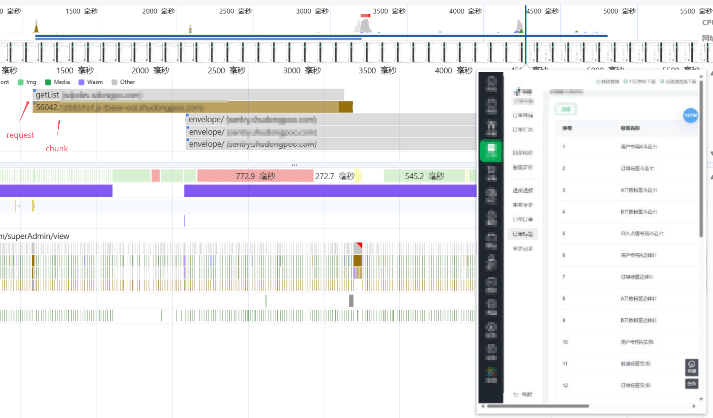

# prefetch-preload

[](https://www.npmjs.com/package/prefetch-preload)

## Table of Contents

- [prefetch-preload](#prefetch-preload)
  - [Table of Contents](#table-of-contents)
  - [Introduction](#introduction)
  - [Working Principle](#working-principle)
  - [Features](#features)
  - [Installation](#installation)
  - [Usage](#usage)
    - [Vue](#vue)
  - [Todo](#todo)
  - [Build and Test](#build-and-test)
  - [Peer Dependencies](#peer-dependencies)
  - [Contributing](#contributing)
  - [License](#license)

## Introduction

`prefetch-preload` is a powerful and flexible npm package that provides utility methods for Vue.js, as well as custom Webpack loaders and plugins. It allows data requests to be made almost at the same level as the chunk.This package is designed to be highly modular, supporting multiple module formats including ES, CommonJS, and UMD.

## Working Principle



## Features

- **Vue.js utility methods**: A collection of useful methods to streamline your Vue.js development.
- **Custom Webpack loaders and plugins**: Enhance your Webpack configuration with custom loaders and plugins.
- **TypeScript support**: Written in TypeScript for type safety and better developer experience.
- **Modular output**: Supports ES, CommonJS, and UMD module formats.
- **Comprehensive testing**: Includes a robust testing setup using Jest.

## Installation

To install the package, you can use npm or yarn:

```bash
npm install prefetch-preload
```

```bash
yarn add prefetch-preload
```

## Usage

### Vue

First, configure plugins and loaders in webpack config. Like this:

```javascript
const {
  RouteMappingPlugin,
  PrefetchAsyncFnPlugin,
} = require('prefetch-preload');

const prefetchAsyncFnDataPath = path.resolve(__dirname, 'prefetchAsyncFn.json');

module.exports = {
  module: {
    rules: [
      {
        enforce: 'pre',
        test: /\.vue$/,
        use: [
          {
            loader: 'prefetch-preload/cjs/loaders/getClientDataLoader.js',
            options: {
              outputPath: prefetchAsyncFnDataPath,
              dirPath: path.resolve('./src'),
            },
          },
        ],
      },
    ],
  },
  plugins: [
    new RouteMappingPlugin({
      routerFilePath: './src/prefetch.js',
      // Can be omitted; the `prefetch.js` file under the `src` directory is used 			by default.
      outputFile: 'route-mapping.[contenthash:8].js', // The output map file
    }),
    new PrefetchAsyncFnPlugin({
      outputPath: prefetchAsyncFnDataPath,
      outputFile: 'prefetchAsyncFn.[contenthash:8].js',
    }),
  ],
};
```

Then,You need to set up `handleRouteBeforeEnter` in the project’s route guard, including the route information and request method:

```typescript
import { handleRouteBeforeEnter } from 'prefetch-preload/esm/vue2';
import { get, post } from './api/request'; // request method

router.beforeEach(function (to, from, next) {
  handleRouteBeforeEnter(to, from, next, { get, post });
});
```

Then.You need to create a file named `prefetch.js` in the project’s `src` directory. Of course, you can place it anywhere and then pass it in through the `RouteMappingPlugin` plugin. In `prefetch.js`, write the pages that need data prefetching in the following format.Note that the name must be `'prefetchRoutes'`:

```js
const prefetchRoutes = [
  {
    path: '/user-credit',
    component: () => import('@/pages/user-credit/list'),
  },
  {
    path: '/orderTag',
    component: () => import('@/pages/order/orderTag'),
  },
];
```

You have now completed the basic configuration. The following explains how to declare the data prefetch method in the page and execute this method to obtain the desired data before the component instance is loaded, this is a example in '.vue' page:

```
import { getClientData, useClientData } from 'prefetch-preload/esm/vue2';

export const getUserList = getClientData((ctx) => {
  return ctx.get('/api/user/list');
});

export default {
  name: 'user-list',
  beforeCreate() {
    useClientData('getUserList').then((res) => {
      if (res.data) {
        this.userList = res.data;
        this.loading = false;
      } else {
        this.userList = [];
      }
    });
  },
  data() {
    return {
      userList: [],
      loading: true,
    };
  },
 }
```

Now, our user list data will be requested immediately when the chunk file for this page is loaded.Here’s a demonstration gif:

Before using prefetch,The data request starts after a period of time once the chunk file has loaded and after waiting for the instance to be fully loaded:



After using preload,You can see that the request for the page data is made even before the chunk file for the page has finished loading. This can significantly enhance the user experience under poor network conditions:



Prefetch performs better in environments with poorer network conditions. Below are the page load speed results under a weak 3G network condition:

Before:



After:



You can see that before using Prefetch, it took about 4300ms from the start of requesting the chunk to the start of requesting data and rendering the page. However, after using Prefetch, this process was reduced to 2100ms, making it 2200ms faster!

## Todo

- [ ] **Simplified configuration**: A more streamlined configuration makes getting started easier.For example, compatible with standardized route definition and self-parsing.
- [ ] **Supports more frameworks**:Supports more frameworks such as Vue and React.
- [ ] **Support for resource preloading**:Supports preloading various resources, not just requests.

## Build and Test

To build the package, use the following command:

```bash
npm run build
```

To run the tests, use the following command:

```bash
npm test
```

## Peer Dependencies

Ensure that the following peer dependencies are installed in your project:

- `babel-core@6.26.3`
- `webpack@^5`
- `babel-loader@>=7.1.5`
- `vue-loader@>=14.2.4`
- `node@>=14`
- `npm@>=6.0.0`
- `html-webpack-plugin@^5.0.0`

You can install them with:

```bash
npm install -D babel-core@6.26.3 webpack@^5 babel-loader@>=7.1.5 vue-loader@>=14.2.4 html-webpack-plugin@^5.0.0
```

## Contributing

We welcome contributions to this project. Please follow these steps to contribute:

1. Fork the repository.
2. Create a new branch with a descriptive name.
3. Make your changes.
4. Commit your changes with clear and concise commit messages.
5. Push your changes to your forked repository.
6. Create a pull request to the main repository.

Please ensure all tests pass and add appropriate tests for any new features or bug fixes.

## Contact

If you have any questions or need assistance, please contact us at [zuojinlong](mailto:zuojinlong@movee.cn).

## License

This project is licensed under the MIT License - see the [LICENSE](LICENSE) file for details.

